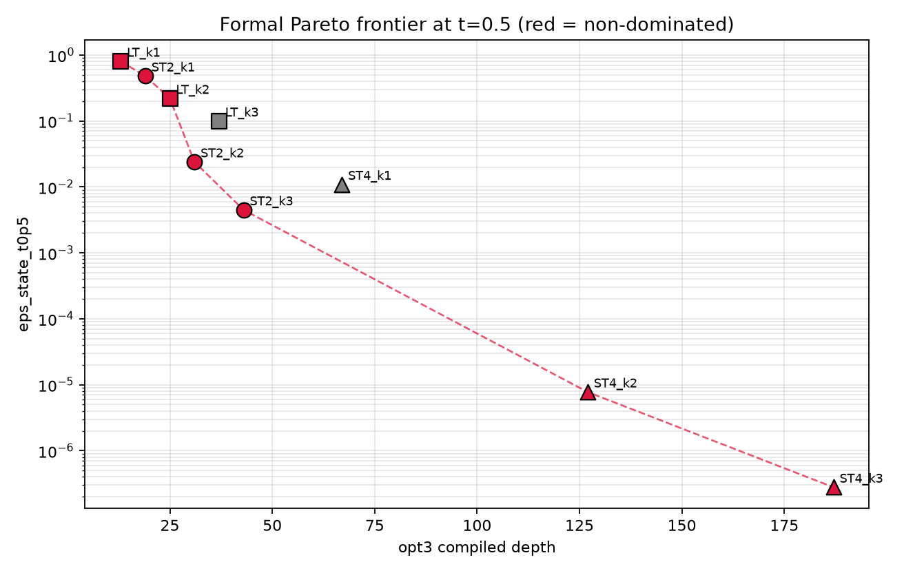
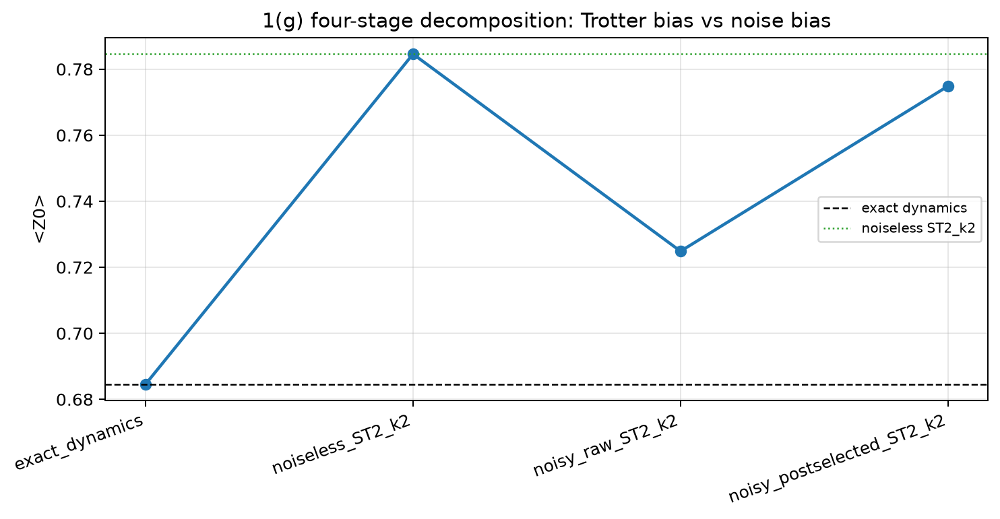
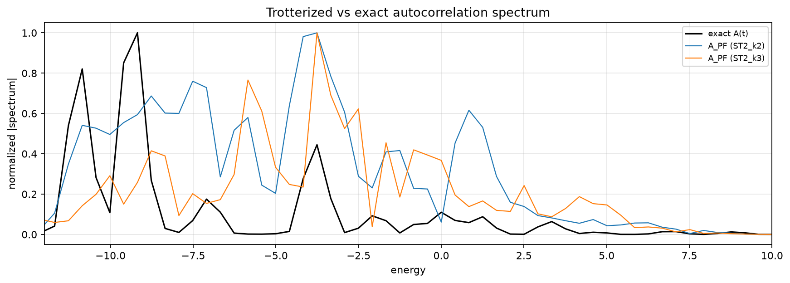

# QHackathon 2026 Problem Set 1

Trotterized quantum simulation of a periodic Heisenberg chain, prepared as a public release after the competition.

The project studies product-formula simulation choices for a 6-qubit periodic Heisenberg Hamiltonian, compares accuracy and compiled circuit resources, adds noisy-simulator qualification for QPU-oriented runs, and includes an optional spectral reconstruction extension.

## Repository Contents

- `notebooks/qhackathon2026_submission.ipynb` - main cleaned notebook for Problems 1, 2, and Bonus 3.
- `notebooks/spectral_expansion.ipynb` - standalone extension on spectral reconstruction from autocorrelation.
- `figures/` - exported plots used by the notebooks and presentation.
- `tables/` - CSV result artifacts, with runtime `job_id` columns removed from public copies.
- `docs/ordering_kak_analysis.md` - detailed note on term ordering and KAK-style two-qubit block synthesis.
- `docs/research_plan.md` - planning notes and experiment design rationale.
- `reports/qhackathon2026_presentation.pdf` - final presentation deck.
- `utils.py` - helper routine for the one-excitation exact reference.

Competition-provided problem PDFs and intermediate backup notebooks are intentionally not included in this public release.

## Highlights

- The grouped ordering exposes adjacent same-bond `XX`, `YY`, and `ZZ` rotations, allowing Qiskit opt-level 2/3 transpilation to reduce the representative `LieTrotter(k=1)` circuit to depth `13` and `18` CX gates.
- The accuracy-resource Pareto table shows the expected trade-off: `ST2_k3` reaches state infidelity about `4.47e-3` at `t=0.5` with depth `43` and `63` CX, while `ST4_k3` reaches about `2.79e-7` with depth `187` and `279` CX.
- Noisy-simulator qualification compares raw, postselection, and MPF-style mitigation candidates before promoting circuits to QPU runs.
- The spectral extension matches dominant autocorrelation FFT peaks to overlap-weighted Hamiltonian eigenenergies within the finite-time frequency resolution.
- Bonus Rustiq comparison is included as an empirical check. In this environment, the standard Qiskit opt-3 circuit for the representative `ST2_k3` case was smaller than the Rustiq-synthesized comparison circuit.

## Selected Artifacts







## Setup

Create an environment with Python and install the dependencies:

```bash
python -m pip install -r requirements.txt
```

The notebooks use Qiskit, Qiskit Aer, Qiskit IBM Runtime, NumPy, SciPy, Matplotlib, Pandas, and NetworkX.

For IBM Quantum Runtime cells, provide credentials through environment variables instead of hardcoding them:

```bash
export IBM_QUANTUM_TOKEN=""
export IBM_QUANTUM_INSTANCE=""
```

The public copy intentionally leaves these values blank.

## Reproducing

Start with:

```bash
jupyter notebook notebooks/qhackathon2026_submission.ipynb
```

The result tables and figures are already exported under `tables/` and `figures/`. Running every QPU-related cell requires a valid IBM Quantum account and available backend access. The notebook is written so that runtime credentials are read from the environment.

## Privacy Cleanup

Before this public release:

- IBM Quantum token, API-token, instance, and CRN values were replaced with empty strings.
- Runtime `job_id` columns were removed from public CSV artifacts.
- Cache folders, temporary files, local OS metadata, and backup notebooks were excluded.

## License

No open-source license has been selected yet. Until a license is added, all rights are reserved by the author.
